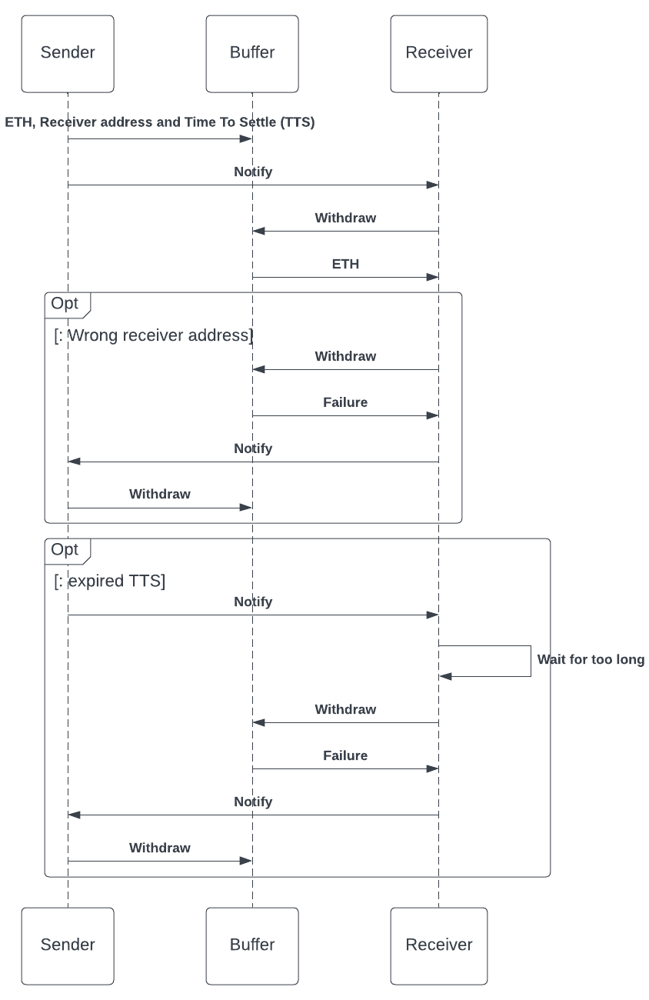

# dBuffer - stressless crypto transactions

dBuffer provides the service for stressless crypto transactions. A decentralised funds buffer for the users allows undoing the mistaken transactions allowing you to double-check the recipient for your funds twice and confirm the transaction with the counter-party before transaction settlement.

## The protocol

To make a crypto payment the ETH sender sends to the dBuffer smart contract the following:
- ETH
- Receiver address
- Time To Settle (optional)

**Time To Settle** – an optional configuration that defines how long a transaction should be available to withdraw to the receiver. When TTS is reached -  sender only can withdraw ETH.

When the transaction to the Buffer is made Sender should notify the receiver.
The receiver can withdraw the ETH only if their wallet address is the same as was configured by the sender at step 1.

If the sender made a mistake in the receiver address receiver won’t be able to withdraw the funds, and then the sender should withdraw and repeat all steps again using proper receiver address.

The protocol should be open-sourced and free of use

## The service
dBuffer dApp provides UI for the protocol:

- Landing page
- Send money page:
  - Connect wallet
  - Prepare transaction
  - Input receiver address
  - Choose currency
  - Amount
  - TTS
- Sign transaction and send
  - Show the link of the payment (/receive/%receiver-address%)
  - Copy the link to the clipboard
- Receive money page
  - Connect wallet
  - If show transactions made for the connected wallet
  - Withdraw transaction funds
  - Sign withdraw request and send

## MVP

- Working with ETH, USDT, USDC only
- Working with Ethereum blockchain only

## Post MVP

- Multiple blockchains (EVM compatible)
- Multi-currency (any ERC-20 tokens)
- NFT (ERC-721, ERC-1155 tokens)
- Show connected wallet balances: tokens and nft
- Mobile app/wallet
- API for integrations
